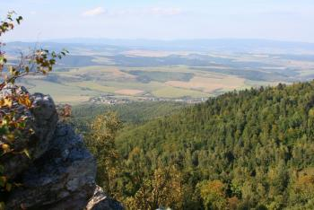
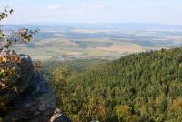
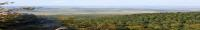
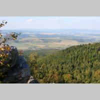
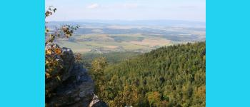
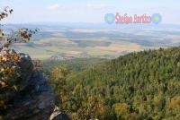

Stefano Image
=============

| Test Status | Code Coverage | Dependencies |
| :---: | :---: | :---: |
| <a href="https://travis-ci.org/bartko-s/stefano-image"></a> | <a href='https://coveralls.io/r/bartko-s/stefano-image?branch=master'></a> | <a href='https://www.versioneye.com/user/projects/51ff632e632bac5343001574'></a> |

Features
--------
- Resize and save image
- Add watermark
- Supported input and output format jpg, png, gif

Dependencies
------------
- php GD2 extension

Instalation using Composer
--------------------------
1. Add following line to composer.json  ``` "stefano/stefano-image": "*" ```

Usage
-----

This is original image



- resize and keep source image aspect ration

```
$maxWidth = 200;
$maxHeight = 200;
$resizer = new \StefanoImage\Image();
$resizer->sourceImage($sourceImage)
        ->resize($maxWidth, $maxHeight)
        ->save($outputDir, $name);
```

This is output



- adaptive resize

```
$width = 200;
$height = 50;
$resizer = new \StefanoImage\Image();
$resizer->sourceImage($sourceImage)
        ->adaptiveResize($width, $height)
        ->save($outputDir, $name);
```

This is output



- pad

```
$width = 200;
$height = 200;
$resizer = new \StefanoImage\Image();
$resizer->sourceImage($sourceImage)
        ->pad($width, $height)
        ->save($outputDir, $name);
```

This is output



- pad and change background image

```
$width = 350;
$height = 150;
$color = array(35, 210, 240);
$resizer = new \StefanoImage\Image();
$resizer->sourceImage($sourceImage)
        ->pad($width, $height, $color)
        ->save($outputDir, $name);
```

This is output



- add watermark

```
$maxWidth = 350;
$maxHeight = 150;
$maxWidthPercent = 40;
$maxHeightPercent = 40;
$opacity = 30;
$watermarkPosition = \StefanoImage\Image::WATERMARK_POSITION_TOP_RIGHT;
$resizer = new \StefanoImage\Image();
$resizer->sourceImage($sourceImage)
        ->resize($maxWidth, $maxHeight)
        ->addWatermark($watermark, $maxWidthPercent, $maxHeightPercent, $opacity, $watermarkPosition)
        ->save($outputDir, $name);
```

This is output



- change output format

```
$resizer->outputFormat(\StefanoImage\Image::OUTPUT_FORMAT_PNG);
```

